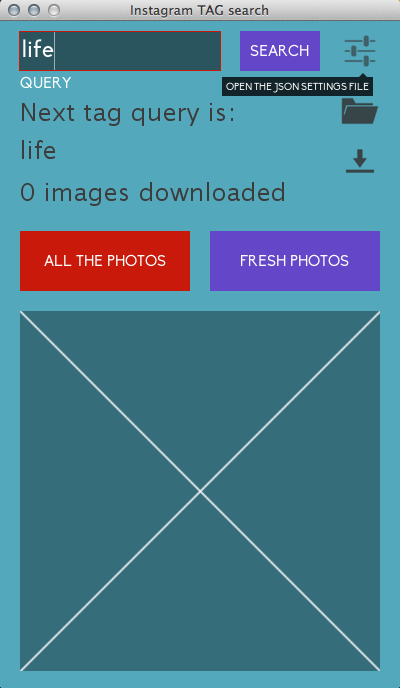

# InstaCrawler 

### a simple Instagram downloader

---

Note: you must have [Processing](www.processing.org) and [ControlP5 library](http://www.sojamo.de/libraries/controlP5/) installed on your computer in order to compile this code. 
You should have a client ID from Instagram, get it [here](http://instagram.com/developer/register/).

### With the above installed open one of the .pde files this is what should happen: 

1. The program will ask you to choose a download folder, don't worry about remembering which one is, you can simply open it later by clicking the button  

2 You **MUST** then click on the Settings button , it will open the settings.json file. Here look for the "client_id" string and paste your Instagram client ID just after '?client_id=' so it will look like '"client_id": "?client_id=95caaxxXxXc64b4efba4afeXXXXxx",'
Save the file and here we go!

2. Write down a tag in the search box and hit **<Enter>** or click the *Search Button*

3. You'll start see the currently downloading picture displayed at the bottom of the interface

4. By default InstaCrawler will look for the most recently tagged media (All The Photos button), you can switch to the very recent media by clicking the Fresh Photos button, **Instacrawler** then will only look for the pictures tagged after you hit the button. 

5. You can change query on the fly by simply writing the new query and hitting **<Enter>**, clicking the search button will toggle the search (it will be turned on if it's off and viceversa)

***

##__Downlaod responsibly and enjoy!!!__

***

There are a lot of thing on the roadmap and I'm not sure when I'll be able to work on this... 

I'd generally like to refine the UX and give more feedback to the user. 
In a future version the user will be able to _moderate_ the download and discard the unwanted picture. 
I want to manage pagination ~~properly~~.
A log of what has been downloaded is welcome too! Isn't it? 

Don't hesitate to ask me anything or request features, I'm eager to know what you need! 
